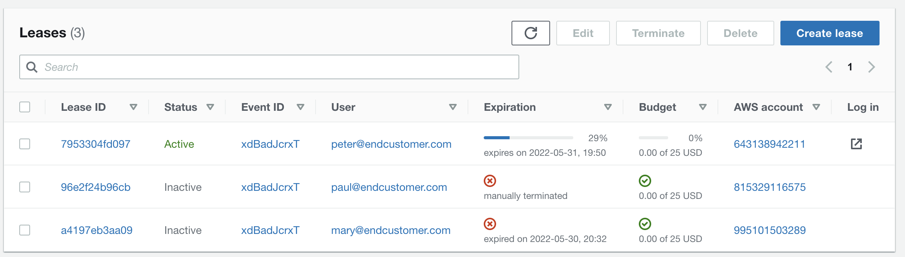
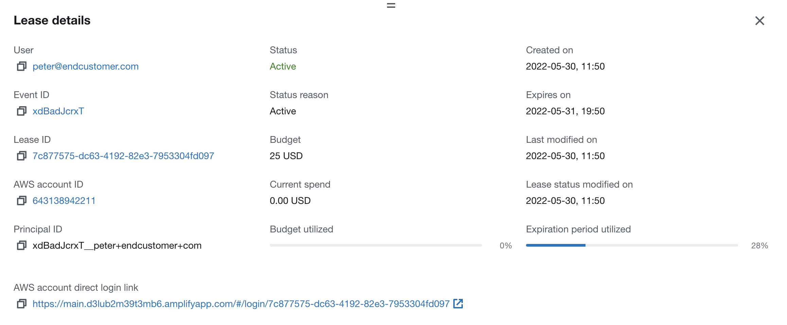
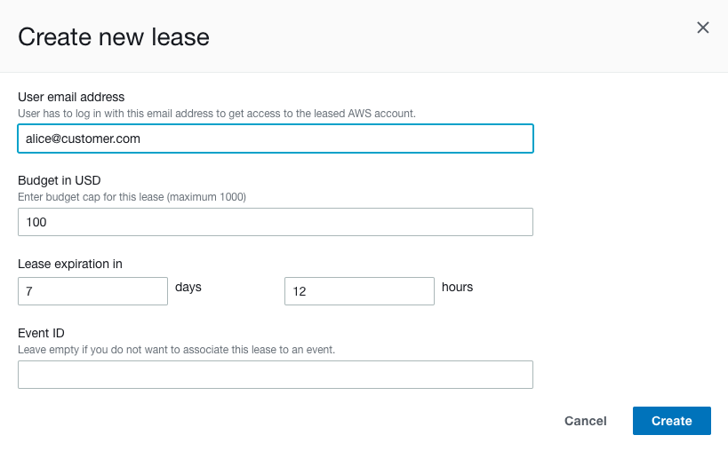
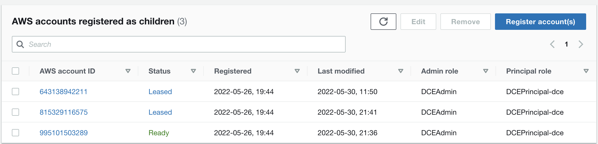
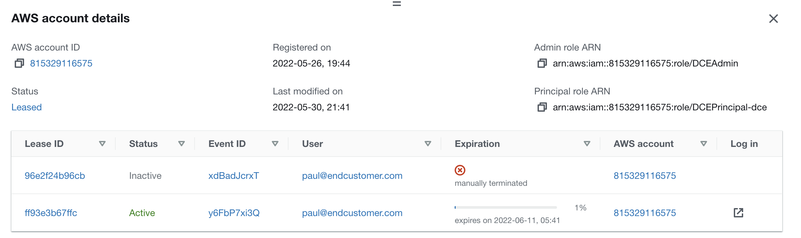
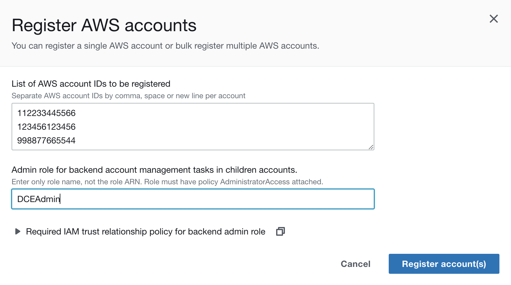
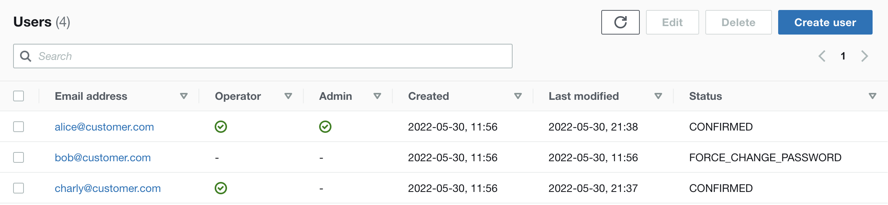
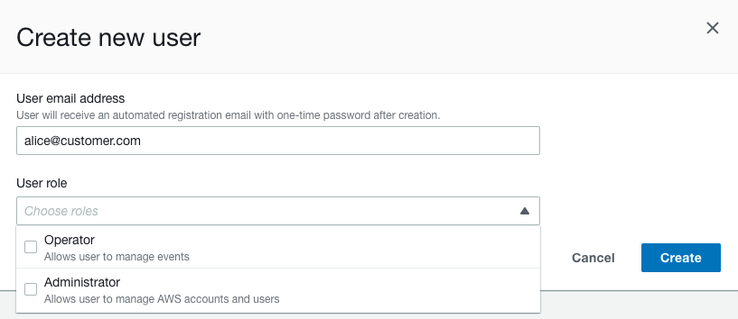
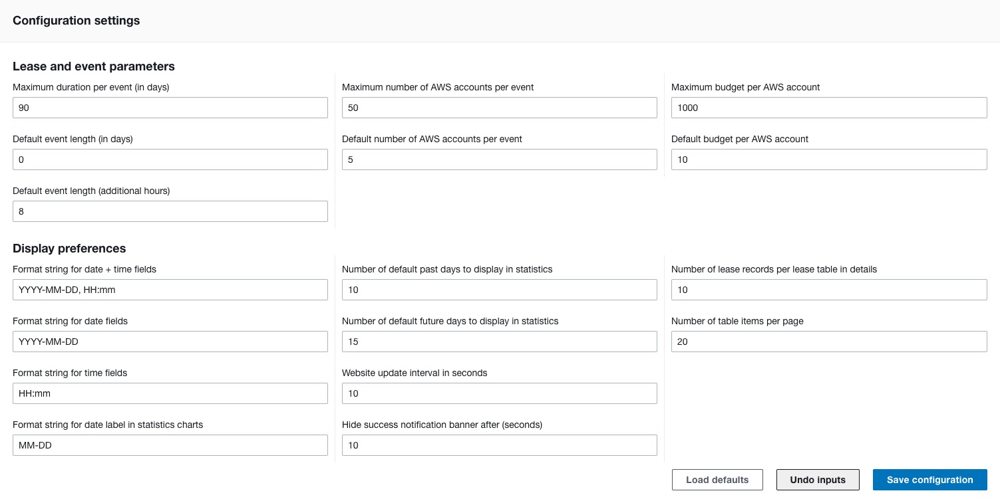

# "Admin" documentation

In *Sandbox Accounts for Events* terminology, an "admin" is responsible managing the AWS infrastructure of *Sandbox Accounts for Events*, such as AWS account pool, user management and application configuration. Admins also have additional permissions to troubleshoot and fix lease lifecycle issues as well as configuring system preferences.  
Some of the Admin actions can directly edit backend database records such as leases and accounts. This can be very helpful to remediate  backend issues, but should be **used with care** as incorrect or inconsistent configuration may also break functionality.  

**Only experienced users should have admin access. No admin access is needed to operate events and provide leases to end users.**

You have to authenticate first before you are able to access Sandbox Accounts for Events (see chapter [Login to Sandbox Accounts for Events](login.md) for details).

# Manage Leases

Here you can see all active and terminated leases. You can sort the table by column (e.g. status or expiration) or filter the list by keywords. Leases can be in one of the following states:

* Active: The lease has been created and assigned to a user. This lease will automatically be terminated when it expires, exceeds its maximum budget or his terminated manually by the operator. "Active" does not indicate that a user has really logged into the assigned AWS account.  
_Note: Leases that are associated with an Event URL can only be accessed when the event is in "Running" status_
* Inactive: The lease has been terminated for one of the following reasons:
    * Expired: The AWS account spend has exceeded its expiration time.    
    _Note: Depending on your backend configuration it can take some time until the scheduler picks up the expired lease and terminates it. By default, the scheduler runs every 60mins._
    * Budget exceeded: The AWS account spend has exceeded the budget limit for this lease.  
    _Note: It can take up to 24hrs for billing data to be cumulated in AWS Cost and Usage report. Do not regard this budget limit as a sufficient security mechanism to prevent misusage of AWS accounts._
    * Manually terminated: The lease has been manually terminated by the operator, or has been terminated automatically when the associated event was terminated.

When you mark a single event via its checkbox, you will be able to see useful additional lease information in the section below the table:

* Lease ID: Unique identifier for each lease
* Principal ID: Identifier for the access handle, has to be unique. In *Sandbox Accounts for Events* this principal ID will be auto-constructed from the event ID and the user email address, which implies that each user can only acces one account per event.
* AWS account direct login link: This URL allows any authenticated *Sandbox Accounts for Events* user to log into the associated AWS account, **regardless** if their email address has been assigned to this lease. You can regard this URL as a direct account access, e.g. to support workshop participants in their own account.

### Creating a new lease

Choose "Create lease" to create a new lease. You will need to enter the following information:

* User email address: The user which this lease is assigned to.
* Budget in USD: Limit of AWS spend per account. This lease will be auto-terminated when the budget is exceeded.  
_Note: It can take up to 24hrs for billing data to be cumulated in AWS Cost and Usage report. Do not regard this budget limit as a sufficient security mechanism to prevent misusage of AWS accounts._
* Lease expiration in: Specify your lease duration here. The lease will auto-terminate after this period of time.
* Event ID: Enter the event ID of your event here to manually assign this lease to an existing event. You can also use this event ID to create multiple accounts for the same user - in this case create your own 10-character identifiers (e.g. "playground" or "sandbox123") for the different leases.
_Note: You can also create new event leases in the "Event Details" page of an existing event (see chapter ["Operator Documentation](operator.md)). In this case the event ID will be prepopulated with the correct event ID._

### Editing a lease

Choose "Actions -> Edit" to edit the lease details. Refer to the chapter "Create a new lease" for details on the input fields.  
**Be aware that you are bypassing the backend logic by directly changing the lease state in the backend database, so make sure you know what you are doing here. Incorrect/inconsistent values can leave your resources in an unstable state.** 

You can edit only one lease at a time.

![Screenshot of dialog "Edit lease for [User Email]"](images/edit-lease.png)

### Terminating a lease

Choose "Terminate" to terminate active leases. Terminating leases includes initialization of AWS account cleanups. If the associated user tries to claim their AWS account again, they will be refused and informed that their associated account has been terminated.
You can terminate up to 10 leases in one go.

### Deleting a lease

Choose "Delete" to delete terminated leases. Deleting will completely remove that lease entry from the backend database. If an associated event user tries to claim their event-based AWS account again, they will be associated a new, fresh account from the account pool.  
You can only delete one lease at a time.

# Manage Accounts

Here you can see all AWS account registered in your account pool. You can sort the table by column (e.g. status) or filter the list by keywords. Accounts can be in one of the following states:

* Ready: The account is clean, available and ready to be leased.
* Leased: The account is currently leased. As soon as the lease is terminated, it will be cleaned up and returned to the "Ready" account pool.
* NotReady: Most likely a lease has ended and it is waiting in the account cleanup queue. As soon as AWS account cleaning it finished, it will automatically be returned to the "Ready" pool.

* Admin role ARN: This role is assumed by the backend to access the account and perform lease creation and cleanup actions. This role needs to have a trust relationship to the master account.
* Principal role ARN: This role will be assumed by end users logging into the account.

### Registering AWS accounts

Choose "Register account(s)" to add existing AWS accounts to the account pool. *Sandbox Accounts for Events* cannot create new AWS accounts, instead it will register already existing accounts. See chapte [Children Accounts](accounts.md) for more details.
To register accounts, you will need to enter the following information:

* List of AWS accounts: List of AWS account IDs you want to register, separated by either comma, space or new line
* Admin role: Name of the role (**not** the role ARN) that the backend can assume in each of these accounts. This role needs to have the IAM policy "AdministratorAccess" assigned and will be assumed on account registration, lease creation and account cleanups.
_Note: Make sure this role has an IAM trust relationship with the master account. You can copy & paste the required policy from the lower section of the dialog. The backend will try to assume this role and check the associated IAM policies before adding the account to the account pool._

You can watch the progress of the account registration in the notification bar on top of the screen. Choose "Show Logs..." to see the details of each account's registration process.

### Editing an account

Choose "Actions -> Edit" to edit the account details. Refer to the chapter "Create a new lease" for details on the input fields.  
Additionally you can change the state of the account manually here. 
**Be aware that you are bypassing the backend logic by directly changing the account state in the backend database, so make sure you know what you are doing here. Incorrect/inconsistent values can leave your resources in an unstable state.** 

You can only edit one account at a time.

![Screenshot of dialog "Edit AWS account [Account ID]"](images/edit-account.png)

### Removing accounts

Choose "Remove" to remove an AWS account from the account pool. Only accounts in "Ready" state can be removed, and will no longer be available for lease after removal.
_Note: Removing accounts will only remove them from the account pool. The AWS accounts will not be deleted or closed, as this is out of scope._

You can remove up to 10 accounts in one go.

# Manage users

Here you can see all users that have registered to *Sandbox Accounts for Events*. You can sort the table by column (e.g. email or created) or filter the list by keywords. Users can also be elevated to have operator and/or admin permissions, providing access to the appropriate menu sections on the left.  
User accounts can have the following status:
* CONFIRMED: The user account is ready to use, users can log in with their email and password
* UNCONFIRMED: The user has followed the "Create Account" flow and defined email and password, but not entered the verification code received by email yet. Please also check the user's email spam folders in case they did not receive a verification email. In case the registration process is stuck, delete the user account and let them re-create their account again.
* FORCE_PASSWORD_CHANGE: An admin has created the user account, the user should have received a registration email with a one-time password that needs to be changed on first login. Please also check the user's email spam folders in case they did not receive a oe-time password email. In case the registration process is stuck, delete the user account and re-create their account again.

Please note that AWS allows to load user accounts only in batches of maximum 60 users. If you have more than 60 users and want to use the sort or filter function to find specific users, make sure to load the users either by crawling through the pagination buttons on top of the table, or choose "load all" to load all user batches to your table. Please not that this is a sequential process and can take some time to complete, depending on the total number of users.

When you mark a single user via the checkbox, you will be able to see the assigned leases for that user.

### Creating a new user

Choose "Create user" to create a new user account. You will need to enter the following information:

* User email address: The user's email address that will be used for logging in.
* User role: Choose if the user may access operator and/or admin resources in *Sandbox Accounts for Events*. See chapter [Concepts](concepts.md) to learn more about the different role permissions and use cases.

### Editing a user

Choose "Actions -> Edit" to edit the user details. The email address can not be changed, but you can edit the operator and/or admin role assignments.  
As an admin, you cannot revoke your own admin rights. Ask other *Sandbox Accounts for Events* admins to remove your admin permissions if needed.

You can edit only one user at a time.

![Screenshot of dialog "Edit user [User Email]"](images/edit-user.png)

### Deleting a user

Choose "Delete" to delete a user account. A deleted user will not be able to log into *Sandbox Accounts for Events* any more (but they will always be able to re-create their account). End users will automatically be deleted when an event is terminated and the associated users are not assigned to any other event. Operators and admins are protected from this automatic deletion.  
As an admin, you cannot delete your own user account. Ask other *Sandbox Accounts for Events* admins to delete your account if needed.

_Note: Users are always able to delete their own user account via the user profile menu on the top right menu._

You can delete up to 10 user accounts in one go.

# Manage configuration settings

As an admin you can define some configuration settings for the *Sandbox Accounts for Events*, such as maximum and default event durations, number of AWS accounts and budgets. Additionally it allows you to adjust some UI parameters such as table page lengths and date/time string formats (see [momentjs format documentation](https://momentjscom.readthedocs.io/en/latest/moment/04-displaying/01-format/) for details).

* Load defaults: Loads hardcoded default values. This will overwrite your input, but not be applied until you save the configuration.
* Undo inputs: This will revert your inputs and load the last saved state again.
* Save configuration: Saves your inputs to the database.

Your configuration settings will apply to all users of *Sandbox Accounts for Events*. If *Sandbox Accounts for Events* cannot read the configuration settings properly, it will fall back to the hardcoded default values. 

# User account lifetime

If you need to change your login password, log out of *Sandbox Accounts for Events* and follow the "Reset password" link on the login dialog. 

For security reasons, you cannot delete your own account. Ask another *Sandbox Accounts for Events* if you need your user account to be deleted. Once your user account is deleted, you will not be able to log into *Sandbox Accounts for Events* any more.