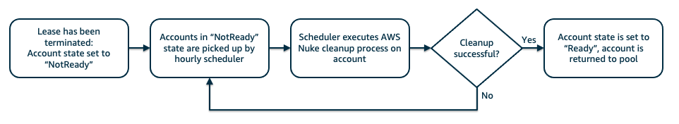

# Sandbox Accounts for Events concepts

To understand the concepts of *Sandbox Accounts for Events* let's look at some basic terminology:

## Users

*Sandbox Accounts for Events* separates its user into three roles: End users, operators and admins. Regardless of their role, each user has to authenticate first before being able to claim a lease (see chapter [Login to Sandbox Accounts for Events](login.md) for details).

### End users

An "end user" is a consumer of a so called "lease", which grants access to an AWS account. End users have no control about lease parameters such as expiration time or lease budget. If an end user claims a lease via an "event", the user will be re-mapped to the same AWS account on subsequent logins.  
A typical end user is a hands-on workshop attendee or a hackathon participant.

### Operators

An "operator" is responsible for managing and distributing leases across end users. Operators can create "events" to allow multiple users to claim leases at the same time, e.g. for workshops. Operators also have an overview about available AWS accounts, budget spends and lease lifecycles.  
A typical operator is a workshop organizer or supporter.

### Admins

An "admin" is responsible for managing the AWS infrastructure of *Sandbox Accounts for Events*, such as AWS account pool, user management and application configuration. Admins also have additional permissions to troubleshoot and fix lease lifecycle issues.  
A typical admin is the technical owner of the *Sandbox Accounts for Events* application.

## Events

Events allow operators to create a single point of access for multiple leases at the same time, providing defaults and centrally managing lease lifetimes and budgets.   
A typical event is a workshop or hackathon.

## Leases

A "lease" is an access token to one of the AWS accounts in the account pool. A lease is always bound to a specific AWS account, which is defined on lease creation. Leases or bound by expiration time and budget limit, exceeding any of those limits will result in the lease being terminated automatically. Leases can be accessed multiple times during its lifetime.  
Leases can be provided as **Event URL** or **Direct Lease URL**, see chapter [End user documentation](user.md) for details.

A lease can have one of the following states:
* "Active": This lease can be used by end users to log into the associated AWS account
* "Inactive": This lease has been terminated and can no longer be used. Lease termination reasons can be "Expired", "OverBudget", "Destroyed" and "Rollback".

## Accounts

To be able to use an AWS account with *Sandbox Accounts for Events*, it needs to be registered first by an admin (see chapter [Admin documentation](admin.md)). After successful registration, the AWS account is parked in an account pool, where it can be claimed 

An account can have one of the following states:
* "Ready": This AWS account is clean and ready to be assigned to a lease, i.e. is part of the free capacity of your account pool. 
* "Leased": This AWS account is currently leased and potentially in use, i.e. is part of the used capacity of your account pool.
* "NotReady": This AWS account is currently blocked and in the process of being cleaned up. Once the cleanup process is finished, it will be returned back as a free account to your account pool.

### Account cleanup

The account cleanup (when an AWS Account is registered to the account pool or returned from a terminated lease) is performed by the Open Source tool [AWS Nuke](https://github.com/rebuy-de/aws-nuke). AWS Nuke scans the AWS account for any resources and deletes it. After successful deletion the account is returned to the account pool for future use.

## Want to learn more about the DCE backend?

Visit the extensive [Disposable Cloud EnvironmentTM documentation](https://dce.readthedocs.io/en/latest/home.html) to learn all about the details and architecture of Optum's DCE project.