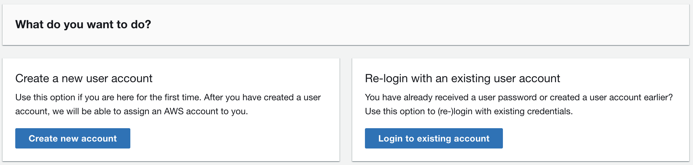

# Log in to *Sandbox Accounts for Events*
To be able to use *Sandbox Accounts for Events*, you need to authenticate first with your user account. Choose either "Create a new user account" or "Re-login with an existing user account" depending on if this is the first time you are using *Sandbox Accounts for Events*.

## Create a new user account
If you have never created a user account for *Sandbox Accounts for Events*, you need to enter your email address and define a password for your user account. Choose "Create Account". It can take up to 5 minutes until you receive an email with a verification code. Enter the provided verification code and log in.   
Please also check your email spam folders in case you did not receive a verification email.

If a user account for this email address already exists, you will see an error message on top of the browser window. If you do not remember the password that has been set for this user account, please follow the "Reset password" flow in the chapter below.

## Re-login with an existing user account
Enter your email address and password to authenticate. If you have forgotten your password, choose "Reset password". You will need to enter the email address of your existing user account and choose "Send code". It can take up to 5 minutes until you receive an email with a verification code. Enter the provided verification code and define your new password. Your new password is activated immediately, so you should now be able to log in successfully.  
Please also check your email spam folders in case you did not receive a verification email.

## Login lifetime

Your user account (email address + password) will be automatically deleted as soon as the event is terminated by the event operator. Except you are using the same user account for multiple events - in this case it will remain valid throughout all active events and is deleted after your last event has been terminated.
