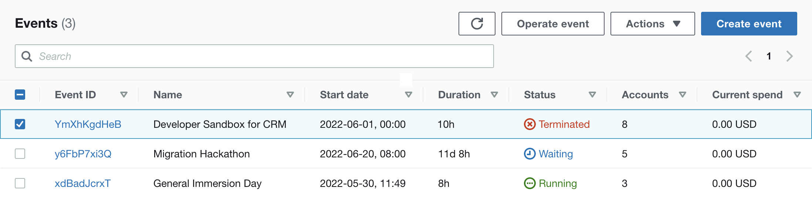
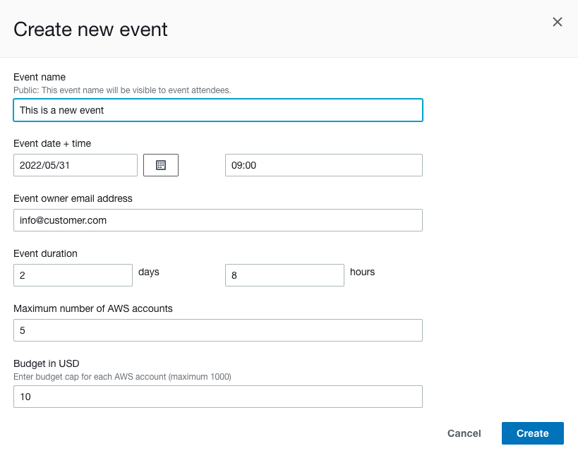
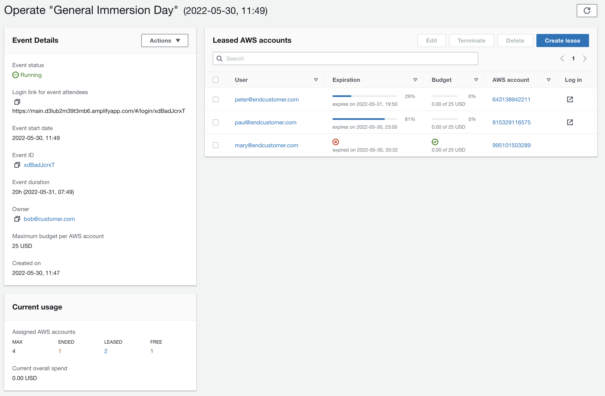
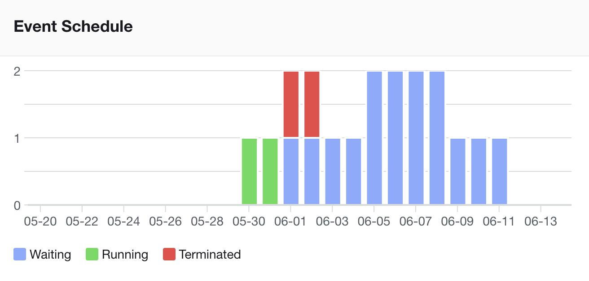
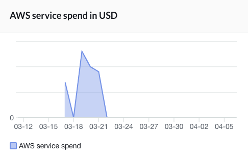
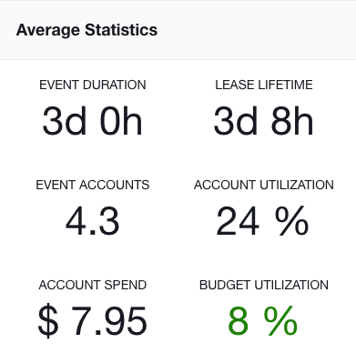
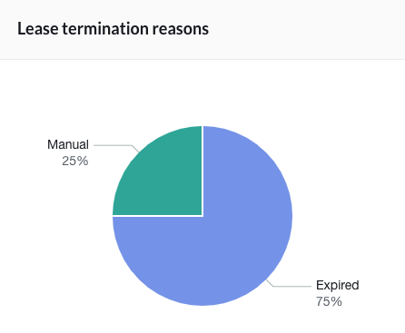
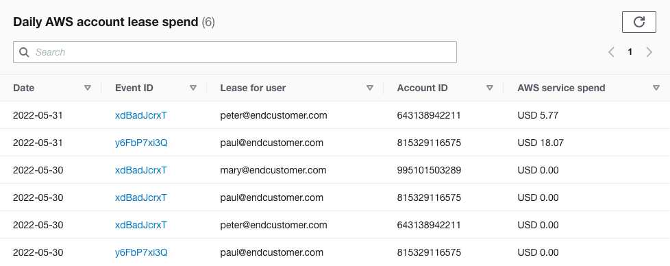

# "Operator" documentation

In *Sandbox Accounts for Events* terminology, an "operator" is responsible for managing and distributing leases across end users. Operators can create "events" to allow multiple users to claim leases at the same time, e.g. for workshops. Operators also have an overview about available AWS accounts, budget spends and lease lifecycles.  

You have to authenticate first before you are able to access *Sandbox Accounts for Events* (see chapter [Login to Sandbox Accounts for Events](login.md) for details).

# Manage Event List

Here you can see all previous and upcoming events. You can sort the table by column (e.g. status or date) or filter the list by keywords. Events can be in one of the following states:

* Waiting: The event is scheduled, but has not been started yet by the operator. Attendees can log into *Sandbox Accounts for Events*, but they will see an info message that the event has not been started yet, so they can not log into their AWS accounts yet.  
_Note: Events never auto-start themselves, but always have to be started manually, regardless if the event start time has already passed._
* Running: The event is active, attendees can log into their AWS accounts now. This state will auto-terminate once the event duration point of time has passed.
* Terminated: The event is inactive and cannot be activated again. The assigned leases have been terminated as well, and the accounts have been returned for cleanup.

When you mark a single event via its checkbox, you will be able to see useful additional event information in the section below the table:

* Login link for event attendees: Distribute this link to your event attendees. It will allow them to access *Sandbox Accounts for Events* and claim one AWS account per attendee, until the maximum number for that event is reached or the account pool is exhausted.
* Maximum/Terminated/Leased/Free AWS Accounts: Overview of AWS account utilization for this event
* Table: Overview of leases associated to this event.

![Screenshot of table "Event: [Event Name]"](images/table-leases-events.png)

### Creating a new event

Choose "Create event" to create a new event. You will need to enter the following information:

* Event name: Your attendees will be able to see this event name
* Event date and time: The point in time you plan to start your event. Nevertheless, the event will not autostart at this timestamp, but you will have to start it manually. You can only specify a date in the future here.
* Event owner email address: This is purely informative and is only stored to make it easier for operators to identify and contact event owners.
* Event duration: Specify your event duration here. A running event will auto-terminate after this period of time, so choose wisely and think about adding extra headroom for unforeseen issues / overrunning events.
* Budget in USD: Limit of AWS spend per account. A lease will be auto-terminated when the budget is exceeded.  
_Note: It can take up to 24hrs for billing data to be cumulated in AWS Cost and Usage report. Do not regard this budget limit as a sufficient security mechanism to prevent misusage of AWS accounts._

### Editing an event

Choose "Actions -> Edit" to edit the event details. Only events in "Waiting" or "Running" state can be edited. Refer to the chapter "Create a new event" for details on the input fields.

Editing event duration or budget limit will only affect *new* leases that are created after saving your changes. If you want to apply your duration and/or budget changes to *existing* leases for this event as well, check the boxes in front of "Overwrite all existing AWS account leases" for duration and/or budget.

You can edit one event at a time.

![Screenshot of dialog "Edit event [Event Name]"](images/edit-event.png)

### Operating an event

Clicking on the event ID in the event table or marking one event and choosing "Operate event" will forward you to the management page for that single event. Refer to the main chapter "Operating a Single Event" below.

### Terminating an event

Choose "Actions -> Terminate" to terminate a waiting or running event. Terminating an event includes revoking all associated leases (including initialization of AWS account cleanups). 
You can only terminate one event at a time.

### Deleting an event

Choose "Actions -> Delete" to delete a terminated event (events in waiting or running state cannot be deleted). Deleting an event includes deleting all associated leases and deleting all associated users (unless they are registered for another event or have operator or admin permissions).  
You can only delete one event at a time. Only terminated events can be deleted.

# Operating a Single Event

Change to the "Manage Events" page, select your event and choose "Operate event". This should be your main page on the day of your event. The "Event details" list on the left provides all event metadata and overview of current AWS account utilization, including the possibility to change the event state or edit event details. Please refer to the chapter "Manage Events" above for details on how to edit or change the state of an event.

The "Leased AWS accounts" on the right shows all leases that are associated with this event. You can directly create, edit, terminate, and delete leases here:

### Creating a lease

Choose "Create lease" to create a new lease for this event. You need to specify the user email address, maximum account budget and lease expiration time. Budget and expiration time will be pre-populated with the event defaults, but you can also adjust it to any required value.  
_Note 1: Event duration: The lease will auto-terminate after this period of time_
_Note 2: Budget in USD: The lease will auto-terminate when the budget is exceeded. Be aware that it can take up to 24hrs for billing data to be cumulated in AWS Cost and Usage report. Do not regard this budget limit as a sufficient security mechanism to prevent misusage of AWS accounts._

### Editing a lease

Choose "Edit" to edit the details for the lease. You can adjust the maximum account budget and lease expiration time. The user email address can not be changed, the user is immutable once the lease has been created. You can only edit one lease at a time.
_Note 1: Event duration: The lease will auto-terminate after this period of time_
_Note 2: Budget in USD: The lease will auto-terminate when the budget is exceeded. Be aware that it can take up to 24hrs for billing data to be cumulated in AWS Cost and Usage report. Do not regard this budget limit as a sufficient security mechanism to prevent misusage of AWS accounts._

### Terminating leases

Choose "Terminate" to terminate active leases. Terminating leases includes initialization of AWS account cleanups. If the associated user tries to claim their AWS account again, they will be refused and informed that their associated account has been terminated.
You can terminate multiple leases in one go.

### Deleting leases

Choose "Delete" to delete terminated leases. Deleting will completely remove that lease entry from the backend database. If the associated user tries to claim their AWS account again, they will be associated a new, fresh account from the account pool.
You can only delete one lease at a time.

# Event Statistics

This page provides a dashboard-like overview of your past and upcoming events. You can adjust the statistics date range if needed.  
The Utilization and Usage Report will provide the following diagrams:

### Event Schedule

This diagram displays all scheduled events, including the event duration. Please note that a 24h event can easily span two days in the diagram, depending on event start time and end time.

### AWS Account lease utilization

This diagram visualizes the current (green) and possible maximum (blue) utilization of leases. Green leases are already provisioned to end users, whereas blue leases have not been created yet, but could possibly be claimed according to the configured maximum amount of AWS accounts in the scheduled events.  
The dotted red line outlines how many AWS accounts are currently managed in your AWS account pool. If you see one of your blue bars exceeding that red dotted line, you are running into the risk of not having enough AWS accounts available for that day. In this case, consider contacting your *Sandbox Accounts for Events* admin and ask for additional AWS accounts to be added to the account pool.

### AWS service spend in USD

This graph gives you an overview of the cumulated AWS service costs per day across all AWS accounts in the account pool. This graph is for high-level overview only - if you need to drill down to specific account's spend, see chapter "Budget Usage" below.

### Average Statistics

This dashboard provides a number of KPIs across your usage:
* Event Duration: Average duration of all events in defined date range
* Lease Lifetime: Average duration of all leases in defined date range. This includes active leases (projected lifetime) and expired leases (real lifetime)
* Event Accounts: Average duration of accounts across all events in defined date range
* Account Utilization: Average ratio of leased AWS accounts vs. reserved AWS accounts per event
* Account Spend: Average AWS service spend per account
* Budget Utilization: Average utilization ratio of AWS service spend vs. budget cap per lease. Includes both active and terminated leases.

### AWS Account pool
This pie chart visualizes the current status of your AWS account pool, listing "Free" accounts, "Leased" accounts and accounts in "Cleaning" state.

### Lease termination reasons
This pie chart provides on overview on the different reasons why leases have been terminated:
* Expired: Lease has reached the end of its lifetime and has been terminated automatically
* Overbudget: Lease has exceeded the limit of its budget cap and has been terminated automatically
* Manually: Lease has been terminated manually by the operator

# Budget Usage
Here you'll find the usage details of each AWS account. *Sandbox Accounts for Events* uses the [AWS Cost and Usage Report](https://docs.aws.amazon.com/cur/latest/userguide) to collect daily AWS service spend and save it into an internal database for later reference. Costs can be filtered by date, event ID, user email address and AWS account id. Be aware that it can take up to 24hrs for the AWS Cost and Usage Report to populate all data.

# User account lifetime

If you need to change your login password, log out of *Sandbox Accounts for Events* and follow the "Reset password" link on the login dialog. 

You can delete your user account at any time: Open the user menu on the top right of your browser window and choose "Delete my user profile" (not possible for admin users). Once your user account is deleted, you will not be able to log into *Sandbox Accounts for Events* any more.