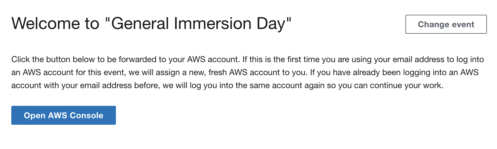
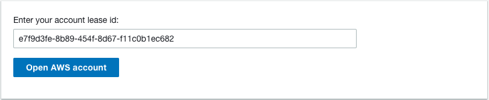

# "End user" documentation

In *Sandbox Accounts for Events* terminology, an "end user" is a consumer of a so called "lease". A "lease" provides authenticated access to an AWS account.

There are two ways how you can receive a lease: "Event URL" and "Direct Lease URL". You have to authenticate first before you are able to claim a lease (see chapter [Login to Sandbox Accounts for Events](login.md) for details).

## Event URL
In this case you have received a link to an existing **event**, not to a pre-defined AWS account. First of all, you need to authenticate, and will be assigned a free AWS account from the account pool on your first login. For subsequent logins during this event, you will automatically be mapped to this AWS account again, allowing you to continue your work already started there.  
Event URL format: https://mydomain.tld/#/login/xxxxxxxxxx

### Login to your AWS account via an Event URL
After successful authentication, you can start to log into your AWS account. Read the information box in the following pop window, and accept the Terms and Conditions by choosing "Accept & Open AWS Console". You will be redirected into your AWS Account Console in a new browser tab.

Note that the event has to be in "running" state to be able to log into your AWS account. Please contact your event operator in case you experience any issues.

## Direct lease URL
Someone has already created a lease for you, this lease is already bound to a pre-defined AWS Account. You will need to authenticate before being able to log into the AWS account. Note that this lease is bound to a specific AWS account, _not_ bound to yourself as a user. If your link is shared with other users, these users will also be able to access the same AWS account after successful authentication, regardless of user name.  
Direct lease URL format: https://mydomain.tld/#/login/xxxxxxxx-xxxx-xxxx-xxxx-xxxxxxxxxxxx

### Login to your AWS account via a Direct Lease URL
After successful authentication, you can start to log into your AWS account. Confirm the lease ID by choosing "Open AWS account". Read the information box in the following pop window, and accept the Terms and Conditions by choosing "Accept & Open AWS Console". You will be redirected into your AWS Account Console in a new browser tab.

## Login lifetime

You can log into your AWS account via the provided lease or event URL as often as you need to and as long as the event is in "running" state. When your lease expires or exceeds its budget (defined by your event operator), your access will be revoked and the AWS account will be automatically cleaned up. It is not possible to re-access an AWS account via a lease that has expired, exceeded its maximum budget or has been terminated manually by the operator. Contact your event operator for any questions around your lease.

## Password change

If you need to change your login password, log out and follow the "Reset password" link on the login dialog. 

## Delete your user account

You can delete your user account at any time: Open the user menu on the top right of your browser window and choose "Delete my user profile". Once your user account is deleted, you will not be able to log in to *Sandbox Accounts for Events* any more.
